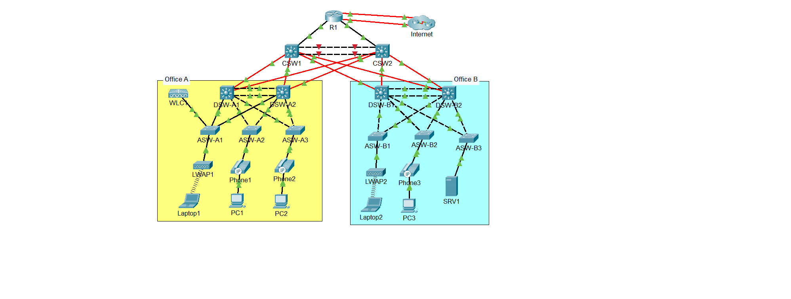

# 3-Tier-CCNA-Mega-Lab

This repository contains my implementation of the **CCNA Mega Lab**, inspired by [Jeremy’s IT Lab](https://www.youtube.com/@JeremysITLab).  
It covers almost every major topic of the CCNA certification and simulates a full enterprise network deployment.

---

## 🚀 Lab Overview
The lab includes:
- Initial Device Setup & Security
- VLANs, Trunking, EtherChannel
- IP Addressing, Layer-3 EtherChannel & HSRP
- Rapid Spanning Tree Protocol
- OSPF (Dynamic Routing)
- Network Services: DHCP, DNS, NTP, SNMP, Syslog, FTP, SSH, NAT
- Security: ACLs, Port Security, DHCP Snooping, DAI
- IPv6 Migration
- Wireless LAN Controller Configuration

---

## 🖥️ Tools & Technologies
- **Cisco Packet Tracer**
- **Cisco IOS Commands**
- Networking concepts from **CCNA Certification**

---

## 🙏 Acknowledgements
A huge thank you to **Jeremy McDowell** (*Jeremy’s IT Lab*) for creating this amazing Mega Lab and sharing it with the networking community.  

